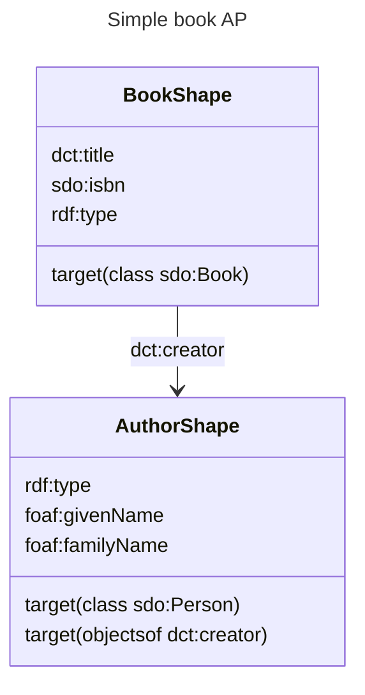

Mermaid diagram created by TAP2Diag

```mermaid
---
url: https://docs.google.com/spreadsheets/d/1Vr_x1ckpxG0v8oq7FGB2Qea8G3ESPFvUWK89H0wJH9w/edit#gid=424305041
title: Simple book AP
description: Simple DC TAP for books
author: Phil Barker
date: 2022-01-14
lang: en
---
classDiagram
	class BookShape
	BookShape : target(class sdo#58;Book)
	class AuthorShape
	AuthorShape : target(class sdo#58;Person)
	AuthorShape : target(objectsof dct#58;creator)
	BookShape : dct#58;title
	BookShape --> AuthorShape : dct#58;creator
	BookShape : sdo#58;isbn
	BookShape : rdf#58;type
	AuthorShape : rdf#58;type
	AuthorShape : foaf#58;givenName
	AuthorShape : foaf#58;familyName
```
